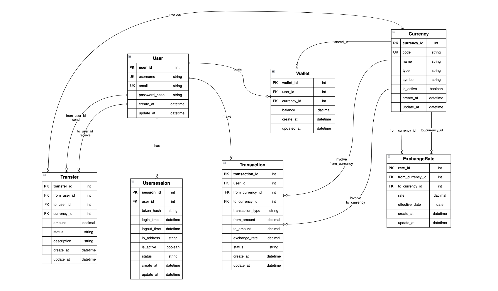

## Crypto Exchange System – Backend Project Exam 
---

### Crypto Exchange System – ER Diagram

you can click on the full pic to see more clearer information or click this link: [PICLink](./ERD_Pic/crypto.drawio1.png)

---

#### Backend prototype of a C2C crypto exchange platform

### Feature
- User register (The login system has not been created yet)
- Wallets per currency per user
- Transfer crypto or fiat to another user in the system
- Exchange between fiat/crypto currencies
- View exchange rate between currency pairs
- Seed data for demonstration

### Technologies
Node.js + Express, 
Sequelize ORM, 
SQLite (default), 
RESTful API design, 
bcrypt for password hashing

### crypto-exchange-system Structure
```
app.js        :  The starting point of Express Server
models/       :  Sequelize models (ORM structure of database tables)
migrations/   :  Sequelize migration files to create/adjust DB schema (via sequelize-cli)
controllers/  :  Manage the logic of each API endpoint
routes/       :  Used to connect API paths to the associated controllers
seeders/      :  Sequelize seed files to populate mock data
config/       :  DB settings (config.json)
```
---


## 🚀 Getting Started with The Project

### 1. Clone the Project
```
git clone https://github.com/Bhornpat/crypto-exchange-system.git
cd crypto-exchange-system
```

### 2. Install Dependencies
```
npm Install
```

### 3. DB Config (SQLite by default) 
In config/config.json:
```
"development": {
  "dialect": "sqlite",
  "storage": "./dev.sqlite"
}
```

## Setup Database

### 1. Run Migrations
```
npm run migrate                 
```
The `dev.sqlite` file will be created automatically


### 2. Seed the Database
```
npm run seed                 
```
> Tables created and filled:
users 
user_sessions
currencies 
wallets   
transfers
transactions 
exchange_rates


## 3. Run the Server 
```
npm run dev
```
------

## Reset Migrations (Full Clean Rebuild)
```
npm run reset
```
>Removes all tables, deletes the SQLite DB file, and re-applies migrations and seeds


## Full Reset + Rerun Server
```
npm run rerun
```
>Full reset and starts the server right after


----
## API Documentation
----

### User register

**POST** /api/users/register
```
{
  "username": "you",
  "email": "you@example.com",
  "password": "1234"
}
```
>User info returned


### Get wallet by user ID

**GET** /api/wallets/:user_id
```
Example: /api/wallets/1
```
>Returns a list of all wallet balances per currency for the user


### Transfer crypto and fiat

**POST** /api/transfer

```
{
  "from_user_id": 1,
  "to_user_id": 2,
  "currency_id": 1,
  "amount": 0.001,
  "description": "โอนคืนเมื่อวาน"
}
```
>Wallet balances are updated automatically with transactions


### Exchange currency

**POST** /api/exchange

```
{
  "user_id": 1,
  "from_currency": "THB",
  "to_currency": "BTC",
  "from_amount": 10000
}
```
>Performs exchange using the latest exchange rate


## Additional indications
====
### Database Lifecycle Control
====

#### 1. Create a table in the database from migrations/
```
npx sequelize-cli db:migrate
```
*Created tables such as: users, wallets, transactions, transfers, etc.*

-------------

#### 2. Run all seed files in seeders/
```
npx sequelize-cli db:seed:all
```
*Used to inject data into SQLite database, without having to create data every time*

--------------

#### 3. Undo the last seeder file only (undo back one file at a time)
```
npx sequelize-cli db:seed:undo
```
*If you have multiple seed files, undo or want to delete the latest test data*

--------------

#### 4. Undo All Seeder Files (Full Clean)
```
npx sequelize-cli db:seed:undo:all
```
*Rolls back every seeder file, very useful before re-running seeds after modifying test data*

-------------

#### 5. Delete all tables in the database, revert all migrations
```
npx sequelize-cli db:migrate:undo:all
```
*Use this if you want to reset the database to start over*. *⚠️ Be careful! It will destroy the structure of all tables *

--------------

#### 6. Delete SQLite database file (like a new format)
```
rm dev.sqlite
```
*Use when you encounter problems like SQLITE_BUSY, no such table or old data is not clean*

-------------

#### 7. Run a single specific seeder file
```
npx sequelize-cli db:seed --seed <fileName>
```
*Instead of running all files in the seeders/*

-------------

#### 8. Create New Migration File
```
npx sequelize-cli migration:generate --name create-transfers
```
*Instead of running all files in the seeders/*

==============

### Create a New Model + Migration automatically
```
npx sequelize-cli model:generate --name <ModelName> --attributes <attribute1>:<type1>,<attribute2>:<type2>,...
```
*One-liner to scaffold the model and the corresponding migration*

-------------

### Create a New Seeder File
```
npx sequelize-cli seed:generate --name <seed_name>
```
*The name within the file the seeder will use to automatically create files with timestamps*

------------

🔍 Seed Data Overview (from your DB)

------------
